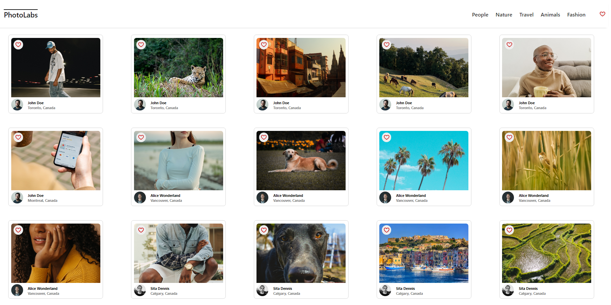
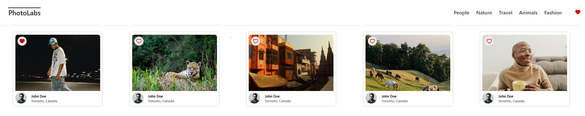
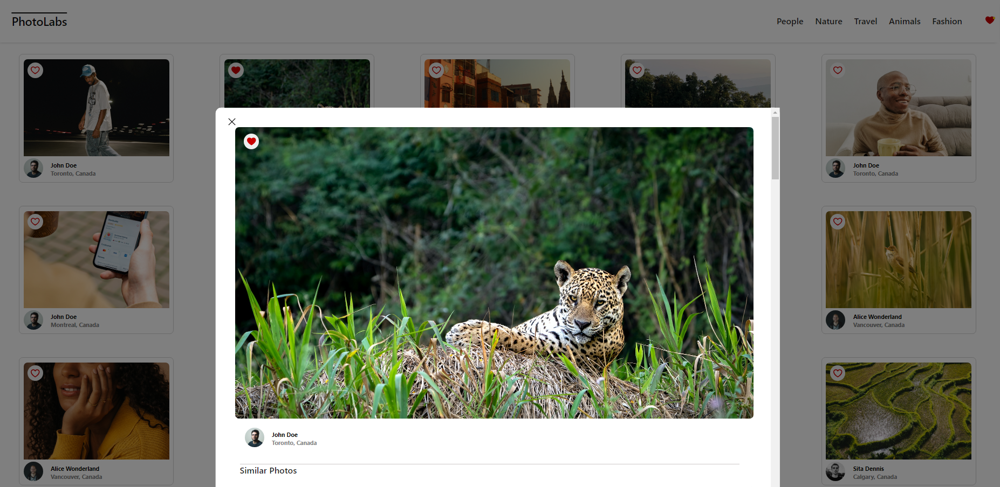
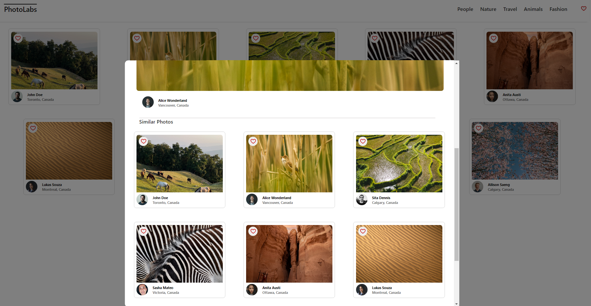

# Photolabs !! 📷


📸 React-based single-page client side application that allows users to view photos in different contexts. 🖼️

# Functional Requirements

-Application's data layer consists of a PostgreSQL database 📊
-The API server consists of a Node Express.js server application 🚀
-The client will communicate with the API over HTTP using the JSON format 📡

# Behavioural Requirements

-A user can view photos from the homepage loaded from the API 🏠
-The user can navigate to different photo topics 🧭
-The user can click on a photo to view a larger version of the photo and relevant / similar photos 🔍
-The user can like a photo from anywhere within the application where the photo is displayed ❤️
-The user can view a heart icon with a notification in the navigation if there are liked photos 💖
-The navigation will consist of different topics and heart icon 📚
-The client-side application will make API requests to load and persist data (i.e. relevant data is not lost after a session restarts, so after a browser refresh) 🔄


# Technical Specifications

-Client application uses Create React App (CRA) ⚛️
-Express is used for API server application 🛠️
-Two different servers were used during development:
-Client-side Webpack development server 🖥️
-API server to provide photo data 📷

## Setup

Install dependencies with `npm install` in each respective `/frontend` and `/backend`.

## [Frontend] Running Webpack Development Server

```sh
cd frontend
npm start
```

## [Backend] Running Backend Servier

Read `backend/readme` for further setup details.

```sh
cd backend
npm start
```
## Application Screenshots

### PhotoLabs Home Page



### User can store one or many favourited photos globally and get notification alert in navigation bar



### User can preview larger image of clicked photo in modal view. The modal also reloads with new photo when user clicks on any similar / related picture. The favourite photos still stays stored across application



###  Modal also displays related / similar photos.



###  User can click on certain topic from navigation bar and app page loads with same category photos list. In example below photos against 'Nature' topic are displayed


## Thankyou!❤️❤️❤️